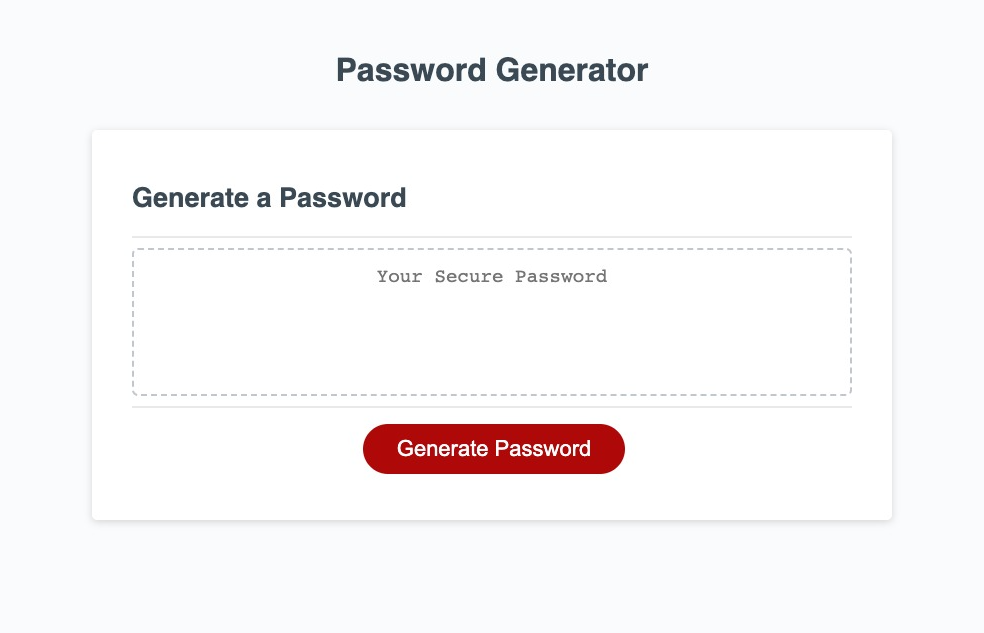

# Password Generator

## Description

As someone who is concerned about online security, using a unique, hard to guess password is important. Thinking of a new password for each login can be challenging. This password generator allows the user to generate a password using random characters given certain criteria about the requirements of the particular system.  The user answers a series of prompts to define how many characters long the password should be and whether it should include upper & lowercase letters, numbers, and special characters. The application then displays the password on the page.

This project reinforced the usefulness of pseudo-coding.  Before I wrote any code, I thought in general terms about how to accomplish this task, leaving the syntax problems until later.  First, I had to feed the application all the possible characters that could go into the password, separated in grouped arrays.  Then, the user's answers to the window prompts would tell the application which of these arrays to add to a new array that would make up the possible character set.  Then I would write a loop to repeat the number of times the user indicated the password length should be, and for each of these items, choose a character randomly from the larger array. Lastly, this new generated array gets converted to a string and appended to the DOM in the output area. Having this mental map was very helpful in preventing me from getting bogged down by syntax errors.

Using the console.log was also very helpful, and it allowed me to check that each step was working properly before moving on to the next step.  I also learned that Google can be my friend. The magnitude of methods available for arrays and objects are a little overwhelming, and I don't quite understand them all yet, let alone when you would reach for some of them over others that perform similar actions.  Seeing what other developers have reached for in similar circumstances was helpful.

## Challenges

Something that was not asked for in the project outline was to clear the generated password field if the user runs the application again.  I tried unsuccessfully to do this, but would like to update this functionality.

## Usage

Provide instructions and examples for use. Include screenshots as needed.

This password generator can be found here: [https://mikewebprint.github.io/password-generator](https://mikewebprint.github.io/password-generator/). 
Click on the Generate Password button and follow the prompts to try it out.

## Credits

As a coding bootcamp project, I was supplied with the HTML of this page and starter JavaScript code which included an event listener for the button and the function to add the generated password to the DOM.  I made some slight modifications here, but wrote the generatePassword() code myself, with the help of multiple searches online to find the correct array and string methods for each step.

## Tests

The application should return an error message if the user tries to enter something other than a number when asked for a password length. If the user declines all character types, no password is generated and an error message should display.  Also, if the user declines to generate a password after clicking the button, the application should revert to the beginning state, without showing 'undefined' in the password field.
